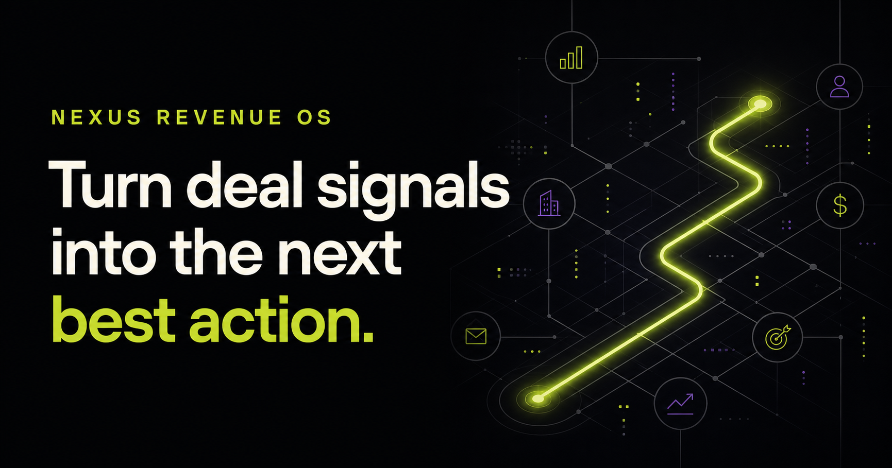

# Nexus Revenue OS



[View the GitHub repository](https://github.com/AndresMupa/nexus-revenue-os)

An explainable, AI-native revenue workspace for B2B teams. Nexus unifies pipeline health, behavioral signals, weighted forecasting, and human-approved next-best actions in one focused interface.

## Why this product

Most CRMs record what happened. Nexus is designed to answer what should happen next — while showing the evidence behind every recommendation. The demo deliberately uses a transparent scoring model and human approval instead of pretending that opaque automation is trustworthy by default.

The market timing is deliberate: Salesforce's 2026 State of Sales identifies AI agents as the top growth tactic for sales teams, while Gartner reports that teams using AI-enabled next-best actions are 2.6× more likely to achieve commercial growth.

## Product highlights

- Interactive multi-stage deal pipeline with search and deal selection
- Explainable deal health and weighted revenue forecast
- Contextual next-best-action recommendations
- Human-in-the-loop controls and visible decision signals
- Responsive product-grade interface with realistic B2B data
- Cloudflare-compatible Next.js/Vinext architecture

## Commercial path

Nexus can be sold to B2B agencies and sales teams as a lightweight revenue intelligence layer. A production edition would connect to HubSpot, Salesforce, email, calendars, and WhatsApp; charge per revenue seat; and offer premium forecasting and workflow packs.

## Engineering signals

- Server-rendered Next.js application packaged for Cloudflare Workers
- Responsive product UI with keyboard-friendly controls and reduced-motion support
- Dynamic Open Graph metadata derived from the request host
- Deterministic demo behavior that never performs hidden external actions
- Automated build, lint, rendered-HTML test, and secret-signature checks

## Run locally

```bash
npm install
npm run dev
```

Then open the local URL printed by the development server.

## Roadmap

1. CRM connectors and event ingestion
2. Durable account/deal store with audit history
3. Configurable scoring rules and model adapter
4. Team permissions and approval workflows
5. Forecast calibration and outcome analytics

## Safety

The current product is a front-end demonstration with deterministic demo data. It does not send customer messages or make autonomous external changes.
